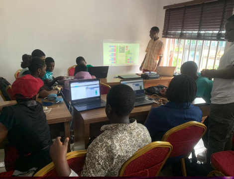
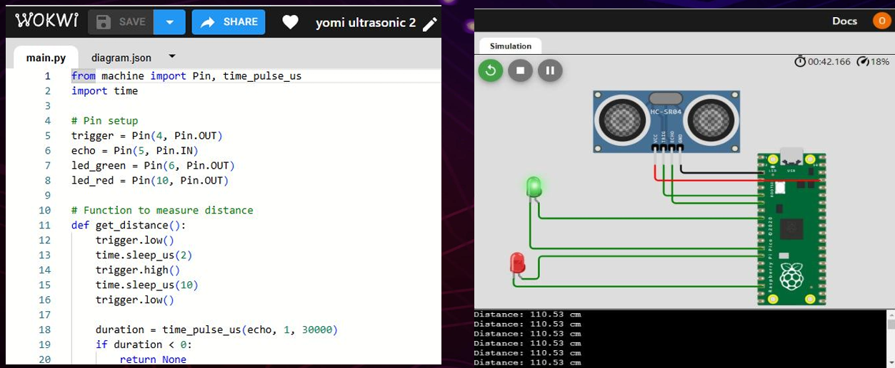
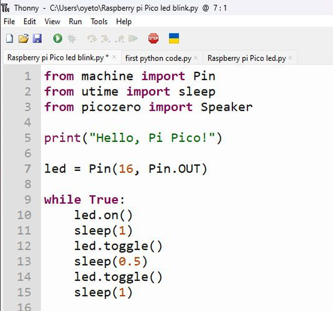
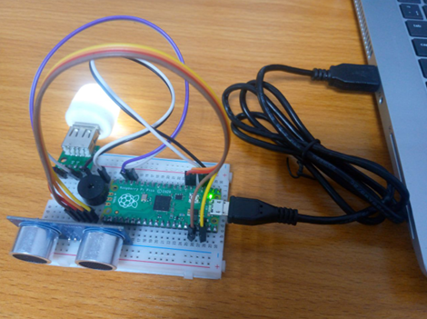
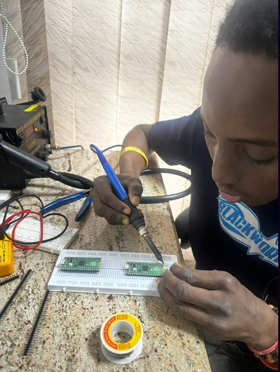

# IoT Smart Lamp — Raspberry Pi Pico

> A proximity-based smart lighting system built with a Raspberry Pi Pico 
> and MicroPython. Designed, built and demonstrated during an IoT training 
> programme for secondary school students at NITDA IT Hub, University of Lagos.



## Overview
This project was part of an IoT training programme I delivered to secondary 
school students at NITDA IT Hub (NitHub), University of Lagos. I designed 
the smart table lamp system, simulated it on Wokwi, built it on a breadboard, 
then guided the students to replicate the project themselves.

The system uses an HC-SR04 ultrasonic sensor to measure distance and 
automatically controls LEDs based on proximity — simulating a smart 
lighting response.

## Key Features
- Raspberry Pi Pico microcontroller
- HC-SR04 ultrasonic sensor for distance measurement
- LED output control based on proximity threshold
- Coded in MicroPython using Thonny IDE
- Circuit simulated on Wokwi.com before physical build
- Breadboard prototype built and demonstrated live to students

## Tools & Platform
| Tool | Purpose |
|---|---|
| Raspberry Pi Pico | Main microcontroller |
| HC-SR04 | Ultrasonic distance sensor |
| MicroPython | Programming language |
| Thonny IDE | Code editor and uploader |
| Wokwi.com | Circuit simulator |
| Breadboard | Physical prototype |

## Code

```python
from machine import Pin, time_pulse_us
import time

# Pin setup
trigger = Pin(4, Pin.OUT)
echo = Pin(5, Pin.IN)
led_green = Pin(6, Pin.OUT)
led_red = Pin(10, Pin.OUT)

def get_distance():
    trigger.low()
    time.sleep_us(2)
    trigger.high()
    time.sleep_us(10)
    trigger.low()
    duration = time_pulse_us(echo, 1, 30000)
    if duration < 0:
        return None
    distance = (duration * 0.0343) / 2
    return distance

while True:
    dist = get_distance()
    if dist and dist < 30:
        led_green.on()
        led_red.off()
    else:
        led_green.off()
        led_red.on()
    time.sleep(0.5)
```

## Simulation


## MicroPython Code on Thonny IDE


## Physical Build


## Soldering


## Teaching Session


## What I Learned
- MicroPython programming for embedded IoT systems
- Ultrasonic sensor interfacing with Raspberry Pi Pico
- Circuit simulation with Wokwi before physical prototyping
- Soldering header pins onto Raspberry Pi Pico boards
- Communicating and teaching technical concepts to beginners
